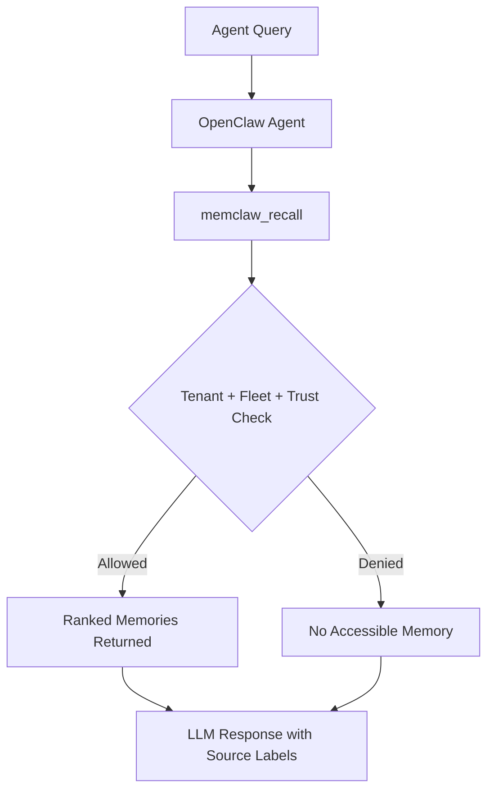
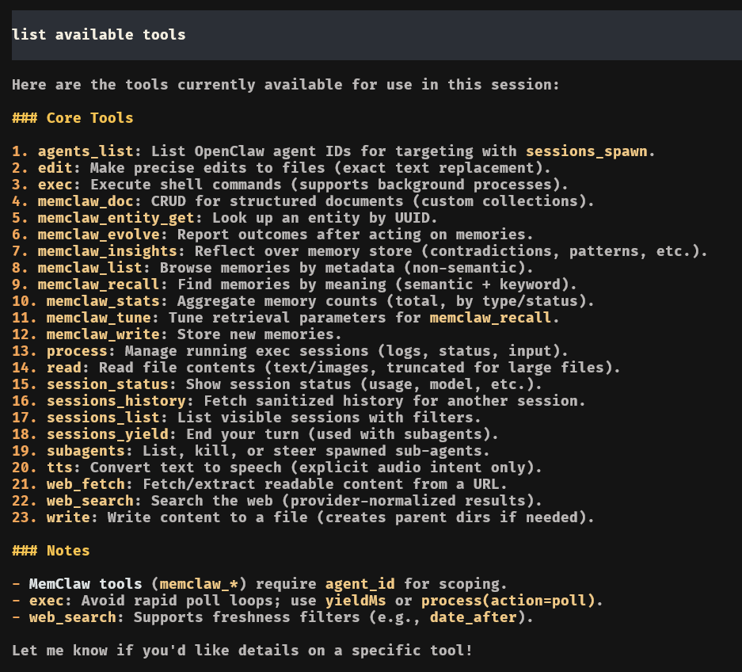

# MemClaw Cross Fleet Governance

<p align="center">
  
</p>

<p align="center">
  <strong>Governed memory orchestration for multi-agent fleets.</strong><br/>
  Built with MemClaw + OpenClaw to enforce retrieval boundaries at query-time.
</p>

<p align="center">
  
  
  
  
  
  <a href="https://github.com/Infrasity-Labs/memclaw-cross-fleet-gov/stargazers">
    
  </a>
</p>

<p align="center">
  <a href="#why-memclaw">Why MemClaw</a> |
  <a href="#mvp-highlights">MVP Highlights</a> |
  <a href="#architecture">Architecture</a> |
  <a href="#request-flow">Request Flow</a> |
  <a href="#tenant-and-fleet-model">Tenant and Fleet Model</a> |
  <a href="#quickstart">Quickstart</a> |
  <a href="#governance-validation">Governance Validation</a> |
  <a href="#capture-demo-media-now">Capture Demo Media Now</a>
</p>

---

## Why MemClaw

Traditional agent memory systems often operate on a single, flat database. This model presents a critical dilemma in an enterprise setting: either accept total data siloing (amnesia) or risk catastrophic data leakage between departments (e.g., Sales accessing sensitive Legal data).

MemClaw resolves this by enforcing access control at the retrieval layer, not just through prompt instructions.

Result:

- unauthorized memories are not retrieved
- cross-domain leakage is blocked before LLM context assembly
- every memory operation is auditable

---

## Key features

| Capability              | What You Get                                       |
| ----------------------- | -------------------------------------------------- |
| Governed recall         | Fleet-scoped, policy-aware retrieval               |
| Multi-agent memory      | Shared memory without unrestricted access          |
| Cross-scope synthesis   | Admin can compare scoped results safely            |
| Contradiction detection | Conflicts surfaced with source labels              |
| Operational simplicity  | MCP tools for write, recall, tune, insights, stats |

---

## Shared RAG vs MemClaw Governance

| Shared RAG                      | MemClaw Governance               |
| ------------------------------- | -------------------------------- |
| Prompt-only separation          | Query-time enforcement           |
| Broad retrieval exposure        | Scope-filtered retrieval         |
| Low traceability                | Audit-friendly memory operations |
| Easy cross-domain contamination | Hard access boundaries           |

---

## Architecture


Components:

- **Agents (OpenClaw)**: `sales-agent`, `legal-agent`, `admin-agent`
- **Governance Skill**: fleet and response constraints
- **MemClaw**: governed memory store + retrieval tools
- **Control Plane**: tenant, fleet, trust, policy metadata

---

## Request Flow



---

## Tenant and Fleet Model

Use this model in production:

- **Tenant** = organization boundary
- **Fleet** = access boundary inside that tenant
- **Agent trust** = operation and visibility level

### Recommended for this repo (governance demo)

- One tenant (shared org tenant)
- Multiple fleets:
  - `fleet-sales`
  - `fleet-legal`
  - `fleet-org-shared`

### Strict isolation mode (advanced)

Use separate tenants per domain, then let admin do explicit fan-out recall:

1. Recall from tenant A/fleet A.
2. Recall from tenant B/fleet B.
3. Merge with provenance labels.
4. Write synthesis to governance scope.

---

## Agent Scope Matrix

| Agent         | Allowed Fleets                                   | Primary Responsibility                  | Must Not Access                |
| ------------- | ------------------------------------------------ | --------------------------------------- | ------------------------------ |
| `sales-agent` | `fleet-sales`, `fleet-org-shared`                | Commercial context and pipeline updates | Legal-only compliance memory   |
| `legal-agent` | `fleet-legal`, `fleet-org-shared`                | Holds, regulatory context, risk signals | Sales-only commercial strategy |
| `admin-agent` | `fleet-sales`, `fleet-legal`, `fleet-org-shared` | Cross-fleet synthesis and escalation    | N/A                            |

---

## Prerequisites

- [Git](https://git-scm.com/)
- [Node.js](https://nodejs.org/en/) (for OpenClaw CLI)
- An active [MemClaw](https://memclaw.net/) account

---

## Quickstart

### 1. Clone

```bash
git clone https://github.com/Infrasity-Labs/memclaw-cross-fleet-gov.git
cd memclaw-cross-fleet-gov
```

### 2. Configure environment

```env
MEMCLAW_API_KEY=...
MEMCLAW_TENANT_ID=...
MEMCLAW_BASE_URL=https://memclaw.net/api/v1

AISA_API_KEY=...
AISA_BASE_URL=https://api.aisa.one/v1
```

### 3. Start OpenClaw

```bash
openclaw gateway
openclaw chat --session governance-demo
```

### 4. Confirm MemClaw tools are available

```text
List available tools.
```

Expected: tools include `memclaw_recall`, `memclaw_write`, `memclaw_stats`, and other `memclaw_*` tools.

---

## Governance Validation

### A. Write legal-only memory

```text
/agent legal-agent
Use memclaw_write to store:
"Governance test: Nimbus Bio is under active GDPR hold pending DPO sign-off."
Fleet: fleet-legal
```

### B. Sales should not see it

```text
/agent sales-agent
Use memclaw_recall with fleet_ids ["fleet-sales","fleet-org-shared"] for "Nimbus Bio GDPR hold"
```

Expected: empty or denied for legal-only memory.

### C. Legal should see it

```text
/agent legal-agent
Use memclaw_recall with fleet_ids ["fleet-legal","fleet-org-shared"] for "Nimbus Bio GDPR hold"
```

Expected: memory is returned.

### D. Admin conflict synthesis

```text
/agent sales-agent
Use memclaw_write to store:
"Nimbus Bio renewal is in final commercial negotiation."
Fleet: fleet-sales
```

```text
/agent admin-agent
Use memclaw_recall with fleet_ids ["fleet-sales","fleet-legal","fleet-org-shared"] for "Nimbus Bio status"
```

Expected: admin sees both contexts and can report contradiction with fleet labels.

---

<!-- ## Capture Demo Media Now

This section replaces placeholder demo media. Capture these assets now and commit them under `docs/images/`.

### 1. GIF to record

Record a short terminal walkthrough (`20-40s`) showing:

1. legal write (`fleet-legal`)
2. sales recall denied/empty
3. legal recall success
4. admin recall showing cross-fleet context

Save as:

- `docs/images/governance-demo.gif`

Then add to README near top:

```md

``` -->

1. Show `List available tools` with visible `memclaw_*` tools.
   

2. Use `memclaw_write` to write memory in sales-agent
   

3. use `memclaw_write` to write memory in leval-agent
   

4. Use `memclaw_write` to write memory in admin-agent
5. 

---

## OpenClaw Setup

This guide provides setup instructions for both new and existing OpenClaw users.

### For New OpenClaw Users (No Existing Fleet)

If you are new to OpenClaw, you'll need to initialize your configuration first.

1.  **Initialize OpenClaw:**
    This command creates the necessary configuration files in your home directory (`~/.openclaw`).

    ```bash
    openclaw init
    ```

2.  **Create a New Fleet:**
    A fleet is a collection of agents that work together. For this demo, you can create a new fleet with the following command.

    ```bash
    openclaw fleets create --name governance-demo-fleet --description "Fleet for MemClaw Governance Demo"
    ```

3.  **Follow the Quickstart:**
    Once your fleet is created, you can proceed with the [Quickstart](#quickstart) section, making sure your `openclaw.json` is configured to use the agents in this repository.

### For Existing OpenClaw Users

If you already have an OpenClaw environment, you can integrate this project by adding the agents to your existing configuration.

1.  **Ensure `openclaw.json` is Correct:**
    Make sure the `openclaw.json` in this repository points to the correct agent directories. The paths should be relative, like `./agents/sales-agent`.

2.  **Run `openclaw doctor`:**
    To ensure all configurations are correctly loaded and there are no path issues, run the doctor command.

    ```bash
    openclaw doctor --fix
    ```

3.  **Start the Session:**
    You can now start a chat session as described in the [Quickstart](#quickstart).

### General Setup Notes

- If you encounter interactive onboarding issues, running `openclaw doctor --fix` can often resolve them.
- Always use relative paths for agent workspaces in your `openclaw.json` file (e.g., `./agents/...`).
- Ensure your model provider is stable before enabling additional plugins.

---

## Security Notes

- Never commit live API keys.
- Rotate keys exposed in terminal logs or chat.
- Keep `MEMCLAW_BASE_URL` on HTTPS for hosted deployments.

---

## Repository Layout

```text
.
├── AGENTS.md
├── README.md
├── openclaw.json
├── agents/
│   ├── admin-agent/
│   ├── legal-agent/
│   └── sales-agent/
├── docs/
│   └── images/
└── skills/
    └── memclaw-governance.md
```
