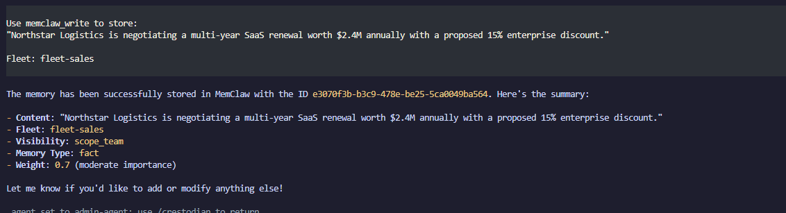
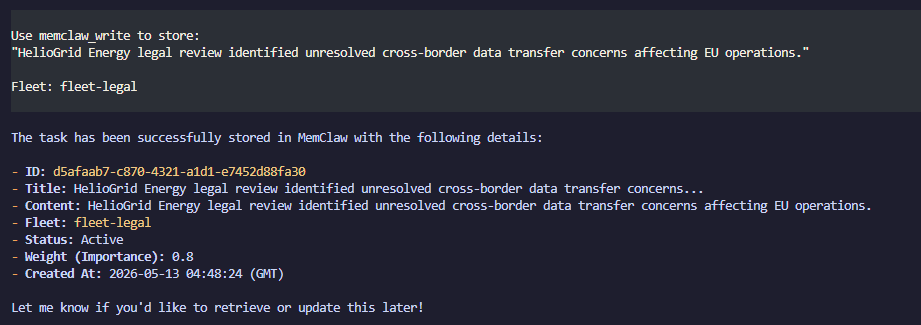
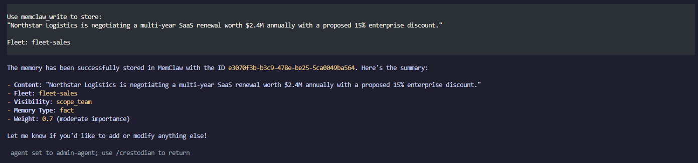

<p align="center">
  
</p>

<h1 align="center">MemClaw Cross-Fleet Governed Memory</h1>

<p align="center">
  <strong>MemClaw gives multi-agent fleets governed, shared, self-improving memory.</strong><br/>
  This repo shows MemClaw enforcing fleet-scoped memory boundaries across three OpenClaw agents<br/>
  <em>at query-time, at the storage layer, before any LLM sees the data.</em>
</p>

<p align="center">
  <a href="https://memclaw.net/docs"></a>
  <a href="https://github.com/caura-ai/caura-memclaw"></a>
  
  
  
  <a href="LICENSE"></a>
  <a href="https://github.com/Infrasity-Labs/memclaw-cross-fleet-gov/stargazers"></a>
</p>

<p align="center">
  <a href="#what-is-memclaw">MemClaw</a> ·
  <a href="#what-is-openclaw">OpenClaw</a> ·
  <a href="#demo">Demo</a> ·
  <a href="#the-problem">The Problem</a> ·
  <a href="#how-it-works">How It Works</a> ·
  <a href="#architecture">Architecture</a> ·
  <a href="#agent-scope-matrix">Agent Scope</a> ·
  <a href="#quickstart">Quickstart</a> ·
  <a href="#governance-validation">Validation</a> ·
  <a href="#creating-a-new-fleet">New Fleet</a> ·
  <a href="https://memclaw.net/docs">Docs</a>
</p>

---

> _Three agents. One memory backend. Zero cross-scope leakage._  
> Sales sees pipeline. Legal sees compliance. Admin sees everything and surfaces the conflicts.

---

## What is MemClaw

[MemClaw](https://memclaw.net) is open-source fleet memory for AI agents: governed, shared, and self-improving. Agents write plain text. MemClaw turns it into searchable, governed, structured memory with automatic enrichment, lifecycle management, and cross-agent knowledge sharing.

**The core loop: write → recall → compound.** Every interaction makes the next one smarter.

What makes MemClaw different from a vector database:

| Capability                  | What it means                                                                                                                                                |
| --------------------------- | ------------------------------------------------------------------------------------------------------------------------------------------------------------ |
| **Fleet isolation**         | Memory partitioned by `fleet_id`. Boundaries are query predicates at the storage layer, not prompt instructions                                              |
| **LLM enrichment on write** | Every `memclaw_write` auto-classifies type, generates title/summary/tags, scans PII, extracts entities, detects contradictions from a single `content` field |
| **Hybrid recall**           | `memclaw_recall` combines vector similarity, keyword search, and knowledge graph traversal in one call                                                       |
| **8-status lifecycle**      | Memories move through `active → confirmed → outdated → superseded → archived` automatically                                                                  |
| **Crystallizer**            | LLM batch process that merges near-duplicate memories into canonical atomic facts with full provenance                                                       |
| **Audit trail**             | Every read and write logged. "Which agent recalled this memory and when" is always answerable                                                                |
| **Karpathy Loop**           | Agents report outcomes via `memclaw_evolve`; the system reinforces what works and generates preventive rules on failure                                      |

This repo is a **use-case implementation**: three OpenClaw agents (Sales, Legal, Admin) operating against a single MemClaw tenant with three fleet partitions, showing what MemClaw's governance layer looks like in a real multi-agent deployment.

<p align="center">
  <a href="https://github.com/caura-ai/caura-memclaw"><strong>→ MemClaw source (Apache 2.0)</strong></a> ·
  <a href="https://memclaw.net/docs"><strong>→ Documentation</strong></a> ·
  <a href="https://memclaw.net"><strong>→ Get an API key</strong></a>
</p>

---

## What is OpenClaw

[OpenClaw](https://www.stack-junkie.com/blog/openclaw-system-prompt-design-guide) is an open-source agent orchestration gateway. It runs locally as a daemon, registers named agents from workspace directories, and exposes them through a unified chat interface and API. Each agent has its own workspace (a directory containing identity files: `SOUL.md`, `AGENTS.md`, `IDENTITY.md`) that are injected as system context at session start, along with its own plugin bindings (MCP servers, memory backends, tools).

In this repo, OpenClaw is doing three things:

- **Routing:** `/agent sales-agent` targets a specific registered agent
- **Context injection:** loads each agent's `SOUL.md` and `AGENTS.md` before the first message
- **Plugin wiring:** registers the MemClaw MCP server so agents can call `memclaw_*` tools natively as tool calls

```bash
npm install -g openclaw@latest
```

---

## Demo

<p align="center">
  <video src="./docs/images/memclaw demo.mp4" controls width="100%"></video>
</p>

> Can't play the video? [Download it here](./docs/images/memclaw%20demo.mp4)

### 1. Sales agent writes to `fleet-sales`



### 2. Legal agent writes to `fleet-legal`



### 3. Admin agent recalls cross-fleet and sees the conflict



> **The conflict:** `fleet-sales` shows the Acme Corp renewal in active negotiation. `fleet-legal` shows the MSA auto-renewal clause requiring legal review before any amendments. Only the admin agent sees both — because only it declares all three fleets in its `memclaw_recall` call.

---

## The Problem

<b>Why not just use a single-agent memory system?</b> In an enterprise, you cannot dump all AI memory into one flat database. Legal handles sensitive compliance data that Sales shouldn't see, but both need to share general account context. Single-agent setups force you to choose between completely siloed amnesia or a massive security nightmare.

| Approach                | Problem                                                                                            |
| ----------------------- | -------------------------------------------------------------------------------------------------- |
| Total memory siloing    | Agents repeat work, miss shared context, have amnesia                                              |
| Open shared memory      | Sales reads Legal holds. Legal reads negotiation ceilings. Data leaks.                             |
| Prompt-level separation | "Don't mention compliance data" — the data still passes through recall. LLMs can still surface it. |

**MemClaw resolves this at the retrieval layer.** Fleet boundaries are enforced as query predicates before the hybrid search runs. An agent cannot surface what it was never given. No prompt engineering required, the guarantee is structural.

---

## How MemClaw Enforces Fleet Boundaries

Every recall call passes through MemClaw's fleet filter before the search executes:

```
Agent calls memclaw_recall(fleet_ids=["fleet-sales", "fleet-org-shared"])
                                │
                                ▼
              MemClaw applies: WHERE fleet_id IN ('fleet-sales', 'fleet-org-shared')
                                │
                      ┌─────────┴──────────┐
                      │  Search executes   │
                      │  inside boundary   │
                      └─────────┬──────────┘
                                │
              fleet-legal records → never searched, never scored, never returned
                                │
                                ▼
                    Ranked results returned to agent
```

This is not a prompt rule. It is a database predicate inside MemClaw's storage layer. The enforcement happens before any LLM sees the data: before context assembly, before scoring, before ranking.

---

## Architecture

<p align="center">
  
</p>

---

## Agent Scope Matrix

| Agent         | Fleet Access                       | Primary Use                               | Hard Boundary               |
| ------------- | ---------------------------------- | ----------------------------------------- | --------------------------- |
| `sales-agent` | `fleet-sales` · `fleet-org-shared` | Pipeline, renewals, deal stage            | Cannot access `fleet-legal` |
| `legal-agent` | `fleet-legal` · `fleet-org-shared` | Holds, compliance, risk flags             | Cannot access `fleet-sales` |
| `admin-agent` | All three fleets                   | Cross-fleet synthesis, conflict detection | None                        |

---

## MemClaw MCP Tools

MemClaw exposes its full capability surface through 10 MCP tools. OpenClaw registers these at gateway start and agents call them as standard tool calls.

| Tool                | What it does                                                                                           |
| ------------------- | ------------------------------------------------------------------------------------------------------ |
| `memclaw_write`     | Store memory with auto-enrichment: type, title, tags, PII scan, entity extraction, contradiction check |
| `memclaw_recall`    | Hybrid vector + keyword search scoped to declared `fleet_ids`                                          |
| `memclaw_manage`    | Read, update, transition, or delete a specific memory                                                  |
| `memclaw_list`      | Browse by metadata: type, status, agent, date                                                          |
| `memclaw_insights`  | LLM-powered reflection: surface contradictions, stale data, failure patterns                           |
| `memclaw_stats`     | Aggregate counts by type, agent, status                                                                |
| `memclaw_evolve`    | Report outcomes against recalled memories and close the learning loop                                  |
| `memclaw_keystones` | Load mandatory governance rules for the current fleet scope                                            |

**Memory lifecycle:** MemClaw moves every memory through `active → confirmed → outdated → superseded → archived` automatically based on contradiction detection and outcome feedback. No manual cleanup.

**Crystallizer:** MemClaw's LLM batch process merges near-duplicate memories into canonical atomic facts with full provenance retained. Runs nightly or on-demand.

**Karpathy Loop:** agents call `memclaw_evolve` to report whether a recalled memory led to a good outcome. MemClaw reinforces memories that work and auto-generates preventive `rule`-type memories on failure. The fleet learns from every interaction.

---

## Why MemClaw vs a Vector DB

|                         | Shared RAG                    | MemClaw Fleet Governance                                       |
| ----------------------- | ----------------------------- | -------------------------------------------------------------- |
| Separation mechanism    | Prompt instruction            | Query predicate enforced at storage layer                      |
| Retrieval scope         | Broad: all vectors searched   | Narrow: `fleet_ids` filter before search                       |
| Cross-agent leakage     | Possible if prompt is ignored | Structurally impossible: data outside fleet is never retrieved |
| Audit trail             | None                          | Every read and write logged                                    |
| Contradiction detection | Manual                        | Automatic on write: RDF triple comparison + LLM analysis       |

---

## Repository Structure

```
.
├── openclaw.json                   ← Gateway config: model, agents, MCP server
├── .env.example
├── agents/
│   ├── sales-agent/
│   │   ├── SOUL.md                 ← Personality, tone, hard limits
│   │   └── AGENTS.md               ← Fleet scope, recall protocol, write rules
│   ├── legal-agent/
│   │   ├── SOUL.md
│   │   └── AGENTS.md
│   └── admin-agent/
│       ├── SOUL.md
│       └── AGENTS.md
└── skills/
    └── memclaw-governance.md       ← Shared skill: fleet_ids rules, recall + write protocol
```

**`SOUL.md`** is injected first on every session and defines who the agent is.  
**`AGENTS.md`** is injected second and defines what the agent does, which fleets it can access, and how it uses MemClaw.  
**`memclaw-governance.md`** is a shared skill copied into every agent workspace. Update once, redeploy to all agents.

---

## Prerequisites

- [Node.js 24+](https://nodejs.org/)
- OpenClaw CLI: `npm install -g openclaw@latest`
- A [MemClaw account](https://memclaw.net) with API key and three fleets provisioned:
  - `fleet-org-shared`
  - `fleet-sales`
  - `fleet-legal`
- An [AISA API key](https://aisa.one) for DeepSeek V3 model access

> **New to MemClaw?** Sign up at [memclaw.net](https://memclaw.net): managed platform, no infrastructure needed. Get your API key from the dashboard and provision the three fleets above before running the gateway. Self-hosted option available via [caura-memclaw](https://github.com/caura-ai/caura-memclaw).

---

## Quickstart

### 1. Clone

```bash
git clone https://github.com/Infrasity-Labs/memclaw-cross-fleet-gov.git
cd memclaw-cross-fleet-gov
```

### 2. Configure environment

```bash
cp .env.example .env
```

```env
MEMCLAW_API_KEY=mc_...
MEMCLAW_TENANT_ID=your-tenant-id
MEMCLAW_API_URL=https://memclaw.net/api/v1
MEMCLAW_AUTO_WRITE_TURNS=false

AISA_API_KEY=sk-...
AISA_MODEL=deepseek-v3
AISA_BASE_URL=https://api.aisa.one/v1
```

### 3. Deploy agent workspaces

**macOS / Linux**

```bash
cp -r agents/sales-agent ~/.openclaw/workspace-sales-agent
cp -r agents/legal-agent ~/.openclaw/workspace-legal-agent
cp -r agents/admin-agent ~/.openclaw/workspace-admin-agent

for agent in sales-agent legal-agent admin-agent; do
  mkdir -p ~/.openclaw/workspace-$agent/skills
  cp skills/memclaw-governance.md ~/.openclaw/workspace-$agent/skills/
done
```

**Windows (PowerShell, run as admin)**

```powershell
# Create junctions so OpenClaw resolves paths correctly
New-Item -ItemType Junction -Path "$HOME\.openclaw\workspace-sales-agent" `
  -Target "E:\WORK\memclaw\memclaw-cross-fleet-gov\agents\sales-agent"

New-Item -ItemType Junction -Path "$HOME\.openclaw\workspace-legal-agent" `
  -Target "E:\WORK\memclaw\memclaw-cross-fleet-gov\agents\legal-agent"

New-Item -ItemType Junction -Path "$HOME\.openclaw\workspace-admin-agent" `
  -Target "E:\WORK\memclaw\memclaw-cross-fleet-gov\agents\admin-agent"
```

### 4. Start the gateway

```bash
openclaw gateway restart
openclaw agents list --bindings   # verify all three agents are registered
openclaw dashboard                 # http://127.0.0.1:18789
```

### 5. Confirm MemClaw tools are loaded

```
List available tools.
```

Expected: `memclaw_recall`, `memclaw_write`, `memclaw_stats`, and other `memclaw_*` tools appear in the session.

---

## Governance Validation

Run these in sequence to verify that MemClaw's fleet isolation is working end to end. Each step demonstrates a different layer of MemClaw's governance model: scoped writes, blocked recall, permitted recall, contradiction seeding, and cross-fleet synthesis.

### Step A: Write to `fleet-legal`

```
/agent legal-agent

Use memclaw_write to store:
  content: "HealthSystem Inc is under active GDPR hold pending DPO sign-off. No contracts or renewals can execute until hold is lifted."
  memory_type: "rule"
  fleet_id: "fleet-legal"
  agent_id: "legal-agent"
```

### Step B: Sales agent should not see it

```
/agent sales-agent

Use memclaw_recall with:
  fleet_ids: ["fleet-sales", "fleet-org-shared"]
  query: "HealthSystem Inc GDPR hold"
  agent_id: "sales-agent"
```

**Expected:** empty result. `fleet-legal` is not in the search space for this call.

### Step C: Legal agent sees it

```
/agent legal-agent

Use memclaw_recall with:
  fleet_ids: ["fleet-legal", "fleet-org-shared"]
  query: "HealthSystem Inc GDPR hold"
  agent_id: "legal-agent"
```

**Expected:** the compliance hold memory is returned.

### Step D: Write a conflicting sales record

```
/agent sales-agent

Use memclaw_write to store:
  content: "HealthSystem Inc renewal in final commercial negotiation. Proposed $420k. Deal stage: negotiation. Expected close Q3 2026."
  memory_type: "episode"
  fleet_id: "fleet-sales"
  agent_id: "sales-agent"
```

### Step E: Admin sees both and surfaces the conflict

```
/agent admin-agent

Use memclaw_recall with:
  fleet_ids: ["fleet-sales", "fleet-legal", "fleet-org-shared"]
  query: "HealthSystem Inc status"
  agent_id: "admin-agent"
```

**Expected:** admin surfaces both the active renewal negotiation from `fleet-sales` and the GDPR hold from `fleet-legal`, flags the contradiction, and identifies this as a cross-team escalation.

### Step F: Run insights on the admin agent

```
/agent admin-agent

Use memclaw_insights with focus: "contradictions"
```

**Expected:** MemClaw's LLM-powered reflection surfaces the HealthSystem Inc conflict with source fleet labels.

---

## Tenant and Fleet Model

```
Tenant: your-org
├── fleet-org-shared    → company-wide context, all agents read + write
├── fleet-sales         → commercial pipeline, sales-agent + admin-agent only
└── fleet-legal         → compliance and risk, legal-agent + admin-agent only
```

**Tenant** = organization boundary (row-level DB isolation)  
**Fleet** = access boundary inside a tenant (query predicate enforcement)  
**Agent trust tier** = controls cross-fleet read, write, and delete permissions

For strict isolation (advanced), provision separate tenants per domain and have the admin agent perform explicit fan-out recall with provenance merging:

1. Recall from tenant-A / fleet-A
2. Recall from tenant-B / fleet-B
3. Merge with source labels
4. Write synthesis to governance scope

---

## Creating a New Fleet

To add a fourth agent scope (e.g. `fleet-engineering`) without touching existing agents:

### 1. Provision the fleet in MemClaw

Log in to [memclaw.net](https://memclaw.net) → your tenant → **Fleets** → **New Fleet**. Set the fleet ID to match what you'll use in code (e.g. `fleet-engineering`). Copy the fleet ID; you'll need it in the next steps.

### 2. Create an agent workspace

```bash
mkdir -p agents/engineering-agent
```

Create `agents/engineering-agent/SOUL.md` (persona), `AGENTS.md` (fleet scope + tool rules), and `IDENTITY.md` (fleet identity). Use an existing agent's files as a template:

```bash
# macOS / Linux
cp agents/sales-agent/SOUL.md agents/engineering-agent/SOUL.md
cp agents/sales-agent/AGENTS.md agents/engineering-agent/AGENTS.md
cp agents/sales-agent/IDENTITY.md agents/engineering-agent/IDENTITY.md
```

Edit each file and replace all references to `sales-agent` / `fleet-sales` with `engineering-agent` / `fleet-engineering`.

### 3. Copy the shared governance skill

```bash
# macOS / Linux
mkdir -p agents/engineering-agent/skills
cp skills/memclaw-governance.md agents/engineering-agent/skills/
```

### 4. Deploy the workspace

**macOS / Linux**

```bash
cp -r agents/engineering-agent ~/.openclaw/workspace-engineering-agent
```

**Windows (PowerShell, run as admin)**

```powershell
New-Item -ItemType Junction -Path "$HOME\.openclaw\workspace-engineering-agent" `
  -Target "E:\WORK\memclaw\memclaw-cross-fleet-gov\agents\engineering-agent"
```

### 5. Register the agent in `openclaw.json`

Add a new entry to the `agents.list` array in `.openclaw/openclaw.json`:

```json
{ "id": "engineering-agent", "workspace": "workspace-engineering-agent" }
```

### 6. Restart the gateway and verify

```bash
openclaw gateway restart
openclaw agents list --bindings   # engineering-agent should appear
```

### 7. Validate fleet isolation

```
/agent engineering-agent

Use memclaw_recall with:
  fleet_ids: ["fleet-engineering", "fleet-org-shared"]
  query: "test"
  agent_id: "engineering-agent"
```

Expected: only memories in `fleet-engineering` and `fleet-org-shared` are returned. Other fleets are structurally excluded.

---

## OpenClaw Setup

### New users

```bash
openclaw onboard --install-daemon
openclaw auth set aisa:default --key "your-llm-api-key"
openclaw doctor
```

### Existing users

If agent workspace paths are doubling on Windows (known path resolution issue), use the junction approach in the Quickstart above. Always use relative workspace names in `openclaw.json` for agents resolved from `.openclaw/`:

```json
{
  "agents": {
    "list": [
      { "id": "sales-agent", "workspace": "workspace-sales-agent" },
      { "id": "legal-agent", "workspace": "workspace-legal-agent" },
      { "id": "admin-agent", "workspace": "workspace-admin-agent" }
    ]
  }
}
```

Run `openclaw doctor` if any agent fails to bind on gateway start.

---

## Security Notes

- Never commit live API keys. Use `.env` and add it to `.gitignore`
- Rotate any key that appears in terminal logs or chat history
- Keep `MEMCLAW_API_URL` on HTTPS for all hosted deployments
- Set `MEMCLAW_AUTO_WRITE_TURNS: false` (boolean, not string) to prevent unintended auto-persistence

---

## Related

- [MemClaw documentation](https://memclaw.net/docs)
- [MemClaw open source (Apache 2.0)](https://github.com/caura-ai/caura-memclaw)
- [OpenClaw agent workspace guide](https://www.stack-junkie.com/blog/openclaw-system-prompt-design-guide)
- [eToro case study: 20+ agents on MemClaw](https://memclaw.net/blog/etoro-company-brain/)

---

<p align="center">
  <strong>Built on <a href="https://memclaw.net">MemClaw</a>: fleet memory for AI agents. Governed, shared, self-improving.</strong><br/>
  <a href="https://github.com/caura-ai/caura-memclaw">Source (Apache 2.0)</a> ·
  <a href="https://memclaw.net/docs">Documentation</a> ·
  <a href="https://memclaw.net/blog/etoro-company-brain/">eToro case study</a>
</p>
